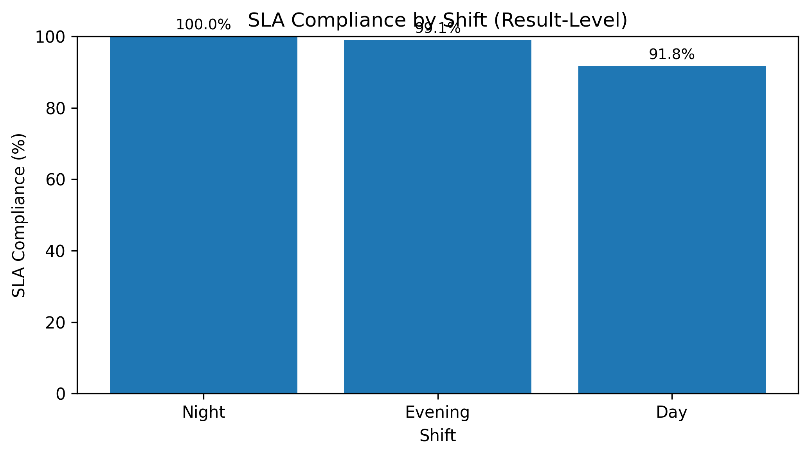
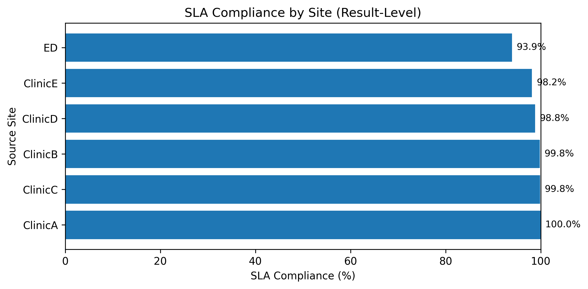
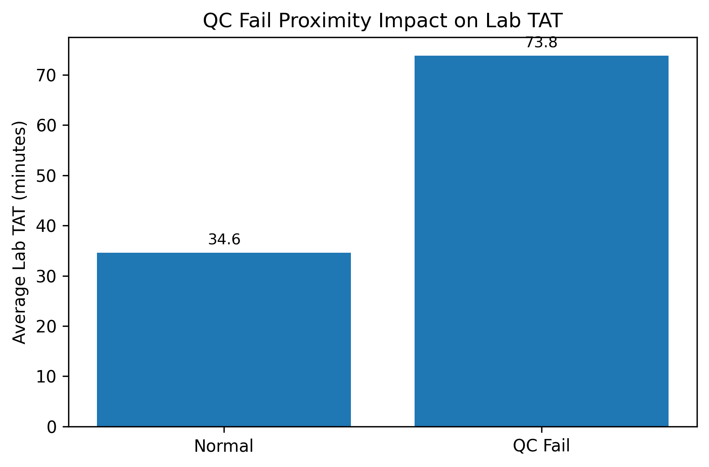
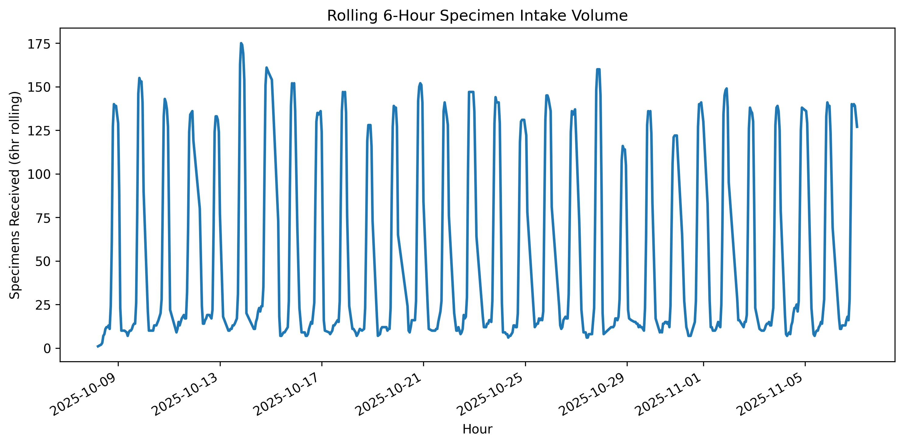
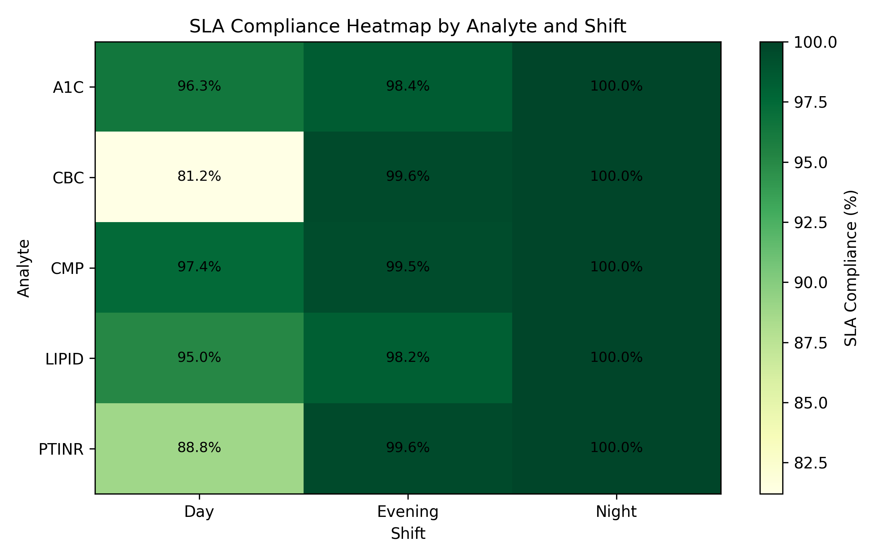

# Lab Ops SQL — SLA, QC Impact & Intake Dynamics

A production-style SQL analysis for a reference lab that:
- standardizes SLA math,
- quantifies QC-fail proximity impact on TAT,
- surfaces rolling 6-hour intake spikes, and
- ships with reproducible views + a notebook.

### SLA (result level)
`SLA % = 100 × AVG( (verified_ts − received_ts) ≤ analyte.tat_target_minutes )`

---

## TL;DR (Key results)

| Slice | Finding |
|---|---|
| **Shift SLA** | **Night ~100.0%**, **Evening ~99.1%**, **Day ~91.8%** → Day is the bottleneck during peak intake. |
| **Site SLA** | Clinics ~98–100%; **ED ~93.9%** → ED drags average (mix + intake timing likely drivers). |
| **QC proximity** | Avg TAT **34.6 min** (normal) vs **73.8 min** (near QC fail) → **+39.2 min / +113%**. |
| **Percentiles vs SLA** | p95 for **A1C/CMP/LIPID/CBC/PTINR** sits below targets; **Day-shift CBC/PTINR** shows the weakest margin. |

> Numbers reflect a synthetic seed; reruns may vary slightly.

---

## Visuals

<table>
<tr>
<td></td>
<td></td>
</tr>
<tr>
<td></td>
<td></td>
</tr>
<tr>
<td colspan="2" align="center"></td>
</tr>
</table>

### Quick reads
- **SLA by Shift**: Day underperforms; Evening/Night are near-perfect.  
- **SLA by Site**: **ED** is the outlier; clinics are consistently high.  
- **QC proximity**: Being within ±60m of a QC fail more than **doubles** TAT.  
- **Rolling intake**: Afternoon → evening surge stresses Day close + early Evening start.  
- **Heatmap**: **CBC/PTINR on Day** is the weakest SLA cell—exactly where volume peaks.

---

## Why this exists
- **Standardize** SLA math across analytes, sites, and shifts.  
- **Quantify** bottlenecks (QC, intake patterns, Day-shift congestion).  
- **Reproduce** via canonical SQL views + one notebook.  
- This is the kind of work a **Data Analyst** does for lab operations, quality, and throughput.

---

## Dataset & approach
- ~30 days synthetic ops; 5 analytes (A1C, CBC, CMP, LIPID, PTINR), 6 sites (ClinicA–E, ED), 3 shifts (Day/Evening/Night). Afternoon-heavy intake.
- **SLA math**: result-level `verified_ts − received_ts` (min) vs analyte SLA target.  
- **QC impact**: flag if a QC fail occurred on the same bench within 60m before result.  
- **Rolling intake**: 6-hour rolling sum from hourly counts.  
- Canonical views (e.g., `synth.sla_shift_v`, `synth.sla_site_v`) included for reuse.

---

## Insights → Actions

| Insight (where it leaks) | Action (what to do) |
|---|---|
| **Day shift** is the constraint: lowest SLA & highest intake pressure. | **Load-balance**: move routine **CBC/PTINR** to Evening/Night; pre-batch “easy wins” before Day peak. |
| **ED** erodes site SLA (mix + surges). | **Courier & lanes**: stagger ED drops; add pre-accession / STAT lanes during peak bands. |
| **QC proximity** adds ~**+39 min** avg TAT. | **QC scheduling**: avoid QC/maintenance near Day peak; guardrails for QC windows vs result windows. |
| Manual verification load during peaks. | **Automation**: expand auto-verify for low-risk analytes during Day (policy-permitting). |

---

### SQL Spotlight — Core Queries

<details>
<summary><b>1) SLA by Shift (result-level)</b> — <i>Which shift misses most often?</i></summary>
<br>

sql
-- Inputs : synth.results, synth.specimens, synth.analytes
-- Outputs: shift, avg_tat_min, sla_hit_pct, n

WITH m AS (
  SELECT
      CASE
        WHEN EXTRACT(HOUR FROM s.received_ts) BETWEEN  7 AND 14 THEN 'Day'
        WHEN EXTRACT(HOUR FROM s.received_ts) BETWEEN 15 AND 22 THEN 'Evening'
        ELSE 'Night'
      END                                             AS shift,
      EXTRACT(EPOCH FROM (r.verified_ts - s.received_ts)) / 60.0 AS tat_min,
      a.tat_target_minutes                            AS sla_min
  FROM synth.results   r
  JOIN synth.specimens s USING (specimen_id)
  JOIN synth.analytes  a USING (analyte_code)
)
SELECT
    shift,
    ROUND(AVG(tat_min), 1)                             AS avg_tat_min,
    ROUND(100.0 * AVG((tat_min <= sla_min)::int), 2)   AS sla_hit_pct,
    COUNT(*)                                           AS n
FROM m
GROUP BY shift
ORDER BY sla_hit_pct DESC;
Notes: adjust shift bands per policy. Helpful indexes:
specimens(received_ts), results(verified_ts), FKs on specimen_id, analyte_code.

</details>
<details> <summary><b>2) QC-Fail Proximity Impact</b> — <i>Does nearby QC failure inflate TAT?</i></summary> <br>
sql
Copy code
-- Inputs : synth.results, synth.specimens, synth.analytes, synth.qc_events
-- Outputs: near_fail (bool), avg_tat, n
-- Window : 60 minutes before verification, same bench

WITH j AS (
  SELECT
      a.bench,
      EXTRACT(EPOCH FROM (r.verified_ts - s.received_ts)) / 60.0 AS tat_min,
      EXISTS (
        SELECT 1
        FROM synth.qc_events q
        WHERE q.bench    = a.bench
          AND q.severity = 'fail'
          AND q.event_ts BETWEEN r.verified_ts - INTERVAL '60 minutes'
                             AND r.verified_ts
      ) AS near_fail
  FROM synth.results   r
  JOIN synth.specimens s USING (specimen_id)
  JOIN synth.analytes  a USING (analyte_code)
)
SELECT
    near_fail,
    ROUND(AVG(tat_min), 1) AS avg_tat,
    COUNT(*)               AS n
FROM j
GROUP BY near_fail
ORDER BY near_fail;
Notes: tune the proximity window as needed. Helpful index:
qc_events(bench, event_ts, severity).

</details>
<details> <summary><b>3) Rolling 6-Hour Intake</b> — <i>Where are the arrival surges?</i></summary> <br>
sql
Copy code
-- Inputs : synth.specimens
-- Outputs: hr (hour bucket), received_count, rolling_6hr_total

WITH timeline AS (
  SELECT generate_series(
           date_trunc('hour', MIN(received_ts)),
           date_trunc('hour', MAX(received_ts)),
           INTERVAL '1 hour'
         ) AS hr
  FROM synth.specimens
),
counts AS (
  SELECT
      t.hr,
      COUNT(*) AS received_count
  FROM timeline t
  JOIN synth.specimens s
    ON s.received_ts >= t.hr
   AND s.received_ts <  t.hr + INTERVAL '1 hour'
  GROUP BY t.hr
)
SELECT
    hr,
    received_count,
    SUM(received_count)
      OVER (ORDER BY hr ROWS BETWEEN 5 PRECEDING AND CURRENT ROW)
      AS rolling_6hr_total
FROM counts
ORDER BY hr;
Notes: great for staffing curves and courier timing. Helpful index:
specimens(received_ts).

</details> ```

---

## Run it

**Prereqs**: PostgreSQL, Python, Jupyter

```bash
pip install -r requirements.txt
Create DB + seed + views

bash
Copy code
psql -U postgres -d Lab -f sql/01_schema.sql
psql -U postgres -d Lab -f sql/02_seed_reference_lab.sql
psql -U postgres -d Lab -f sql/03_views_sla.sql
psql -U postgres -d Lab -f sql/04_calibrate_p95.sql
Configure env (never commit secrets)

bash
Copy code
# .env.example → copy to .env and set your values
PG_HOST=localhost
PG_PORT=5432
PG_DB=Lab
PG_USER=postgres
PG_PASSWORD=changeme
Run the notebook

mathematica
Copy code
notebooks/01_SLA_Analyst_Report.ipynb → Run All
Outputs render inline and save to visuals/.

Project structure
pgsql
Copy code
lab-sql/
├─ README.md
├─ requirements.txt
├─ .gitignore
├─ .env.example
├─ notebooks/
│  └─ 01_SLA_Analyst_Report.ipynb
├─ sql/
│  ├─ 01_schema.sql
│  ├─ 02_seed_reference_lab.sql
│  ├─ 03_views_sla.sql
│  ├─ 04_calibrate_p95.sql
│  └─ sla_by_analyte_shift.sql
└─ visuals/
   ├─ fig_sla_by_shift.png
   ├─ fig_sla_by_site.png
   ├─ fig_qc_fail_impact.png
   ├─ fig_rolling_6hr.png
   └─ fig_sla_heatmap.png
SQL spotlight (core queries)
<details> <summary><b>1) SLA by Shift (Result level)</b></summary>
sql
Copy code
WITH m AS (
  SELECT
    CASE
      WHEN EXTRACT(HOUR FROM s.received_ts) BETWEEN 7 AND 14  THEN 'Day'
      WHEN EXTRACT(HOUR FROM s.received_ts) BETWEEN 15 AND 22 THEN 'Evening'
      ELSE 'Night'
    END AS shift,
    EXTRACT(EPOCH FROM (r.verified_ts - s.received_ts))/60 AS tat_min,
    a.tat_target_minutes AS sla_min
  FROM synth.results  r
  JOIN synth.specimens s USING (specimen_id)
  JOIN synth.analytes  a USING (analyte_code)
)
SELECT
  shift,
  ROUND(AVG(tat_min), 1)                           AS avg_tat_min,
  ROUND(100.0 * AVG((tat_min <= sla_min)::int), 2) AS sla_hit_pct,
  COUNT(*)                                         AS n
FROM m
GROUP BY shift
ORDER BY sla_hit_pct DESC;
</details> <details> <summary><b>2) QC-fail proximity impact</b></summary>
sql
Copy code
WITH j AS (
  SELECT a.bench,
         EXTRACT(EPOCH FROM (r.verified_ts - s.received_ts))/60 AS tat_min,
         EXISTS (
           SELECT 1
           FROM synth.qc_events q
           WHERE q.bench = a.bench
             AND q.severity = 'fail'
             AND q.event_ts BETWEEN r.verified_ts - INTERVAL '60 minutes' AND r.verified_ts
         ) AS near_fail
  FROM synth.results r
  JOIN synth.specimens s USING (specimen_id)
  JOIN synth.analytes  a USING (analyte_code)
)
SELECT near_fail, ROUND(AVG(tat_min),1) AS avg_tat, COUNT(*) AS n
FROM j
GROUP BY near_fail
ORDER BY near_fail;
</details> <details> <summary><b>3) Rolling 6-hour intake</b></summary>
sql
Copy code
WITH timeline AS (
  SELECT generate_series(
           date_trunc('hour', MIN(received_ts)),
           date_trunc('hour', MAX(received_ts)),
           interval '1 hour') AS hr
  FROM synth.specimens
),
counts AS (
  SELECT t.hr, COUNT(*) AS received_count
  FROM timeline t
  JOIN synth.specimens s
    ON s.received_ts >= t.hr AND s.received_ts < t.hr + interval '1 hour'
  GROUP BY t.hr
)
SELECT hr,
       received_count,
       SUM(received_count) OVER (ORDER BY hr ROWS BETWEEN 5 PRECEDING AND CURRENT ROW)
         AS rolling_6hr_total
FROM counts
ORDER BY hr;
</details>
Tech: PostgreSQL (window functions, percentiles, time bucketing) • Python/Jupyter (Matplotlib) • Reproducible SQL views
License: MIT
Notes: Reseeding regenerates visuals; values may shift but insights/actions hold. All data are synthetic (no PHI).

makefile
Copy code
::contentReference[oaicite:0]{index=0}
